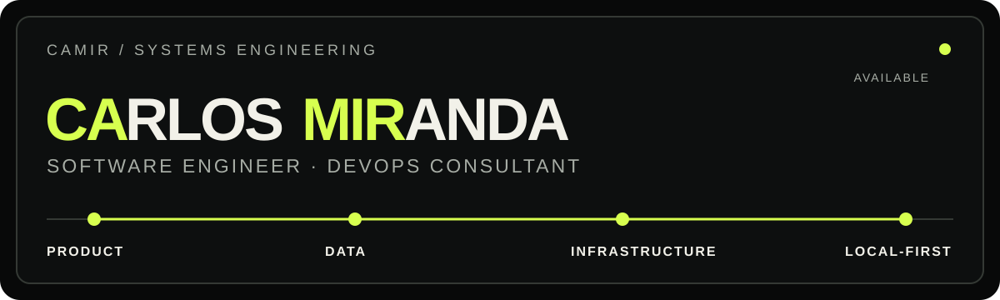

  <picture>
    <source media="(max-width: 600px)" srcset="./assets/profile-header-mobile.svg" />
    
  </picture>

  <a href="https://camir.tech">camir.tech</a> &nbsp;·&nbsp;
  <a href="https://www.linkedin.com/in/camircode/">LinkedIn</a> &nbsp;·&nbsp;
  <a href="mailto:carlosmir.code@gmail.com">carlosmir.code@gmail.com</a> &nbsp;·&nbsp;
  <a href="https://camir.tech/downloads/Carlos-Miranda-CV-es.pdf">CV en español</a> &nbsp;·&nbsp;
  <a href="https://camir.tech/downloads/Carlos-Miranda-CV-en.pdf">CV in English</a>

# Construyo sistemas que conectan producto, datos y operaciones

Desarrollador de software y consultor DevOps en el Estado de México. Escribo la
interfaz y el backend, aplicaciones de escritorio y Android con Tauri, y la
infraestructura declarativa que va de Proxmox a Kubernetes y de ahí a GitOps.

Soy Técnico en Informática y aprobé el examen profesional por unanimidad y con
honores. Estudio Ingeniería en Software e Ingeniería en Inteligencia Artificial
en Hybridge, en línea.

## Proyectos

| Proyecto | Qué es | Stack principal | Enlaces |
| --- | --- | --- | --- |
| **Infraestructura declarativa** | Un servidor de OVHcloud que va de Proxmox a Kubernetes y de ahí a GitOps. | Proxmox VE · Terraform · Ansible · Argo CD | [Caso de estudio](https://camir.tech/proyectos/infraestructura/) |
| **2 Free** | Finanzas personales local-first, cifradas y autohospedables para web, Linux y Android. | Next.js · NestJS · Tauri · Rust | [Sitio](https://2free.camir.tech) · [Código](https://github.com/camircode/2free) · [Caso](https://camir.tech/proyectos/2free/) |
| **Pokédex Manager** | Catálogo de PokéAPI, colección aislada por cuenta y un asistente que responde con herramientas MCP. | TanStack Start · React · MongoDB · MCP | [Sitio](https://pokedex.camir.tech) · [Código](https://github.com/camircode/pokedex-manager) · [Caso](https://camir.tech/proyectos/pokedex/) |
| **FER&REN Portal** | Diez aplicaciones conectadas para personas, taller, ventas, finanzas e infraestructura. | Astro · Preact · Directus · Go | [Caso de estudio](https://camir.tech/proyectos/portal/) |
| **FER&REN Detailing** | Diecinueve páginas de servicio que llevan un interés concreto a una conversación por WhatsApp. | Astro · TypeScript · GSAP | [Sitio](https://ferrendetailing.com.mx) · [Caso](https://camir.tech/proyectos/ferren-landing/) |

Los repositorios de 2 Free viven separados:
[twofree-api](https://github.com/camircode/twofree-api),
[twofree-web](https://github.com/camircode/twofree-web),
[twofree-packages](https://github.com/camircode/twofree-packages) y
[twofree-landing](https://github.com/camircode/twofree-landing).
El [portfolio](https://github.com/camircode/portfolio) también es código abierto.

## Tecnologías

Cada una tiene su página en [camir.tech/tecnologias](https://camir.tech/tecnologias/),
donde explico para qué sirve y cómo la uso.

| Área | Herramientas |
| --- | --- |
| **Lenguajes** | TypeScript · JavaScript · Go · Rust · HTML · CSS |
| **Web e interfaz** | Astro · React · Next.js · Preact · TanStack · Tailwind CSS · GSAP |
| **Backend y datos** | NestJS · Node.js · Prisma · PostgreSQL · MongoDB · SQLite y SQLCipher · Supabase · Directus · Better Auth |
| **Nativo** | Tauri · Flutter |
| **Infraestructura** | Proxmox VE · Kubernetes · Terraform · Ansible · Docker · Dokploy · Cloudflare · WireGuard · Linux · Bash |
| **Entrega y observabilidad** | Jenkins · GitHub Actions · Argo CD · Prometheus · Grafana · Bitwarden |
| **Calidad y herramientas** | Vitest · Playwright · Vite · pnpm · Git |
| **IA** | Claude Code · Model Context Protocol |

## Contribuciones

  <picture>
    <source media="(prefers-color-scheme: dark)" srcset="https://raw.githubusercontent.com/camircode/camircode/output/snake-dark.svg" />
    <source media="(prefers-color-scheme: light)" srcset="https://raw.githubusercontent.com/camircode/camircode/output/snake-light.svg" />
    
  </picture>

